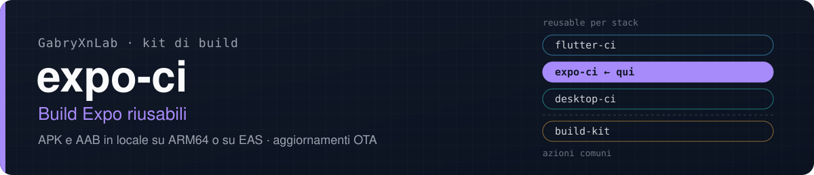
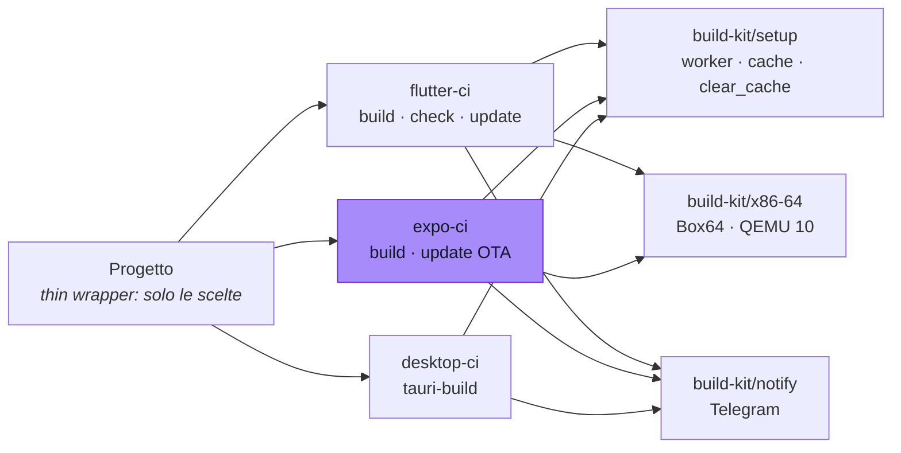

<p align="center">
  
</p>

<p align="center">
  <a href="https://github.com/GabryXnLab/flutter-ci">flutter-ci</a> ·
  <a href="https://github.com/GabryXnLab/expo-ci"><b>expo-ci</b></a> ·
  <a href="https://github.com/GabryXnLab/desktop-ci">desktop-ci</a> ·
  <a href="https://github.com/GabryXnLab/build-kit">build-kit</a>
</p>

<p align="center">
  
  
  
  <a href="LICENSE"></a>
  <a href="https://github.com/GabryXnLab/expo-ci/commits/main"></a>
</p>

**Build Android e aggiornamenti OTA di un'app Expo (React Native) con un thin wrapper: APK e AAB compilati in locale su un runner ARM64 o sui server di EAS, e update OTA sul canale giusto.**

[Perché](#perché) · [Avvio rapido](#avvio-rapido) · [Cosa c'è](#cosa-cè) · [Riferimento](#riferimento) · [Architettura](#architettura) · [Fuori dall'org](#usarlo-fuori-dallorg) · [Manutenzione](#per-chi-lo-mantiene)

## Perché

- **Due strade, un solo wrapper.** `build_target: local` compila sul runner self-hosted ARM64 dell'org con Gradle nativo; `build_target: eas` delega tutto a EAS. Lo stesso vale per gli update (`update_target`).
- **Codice nativo compilato davvero su ARM64.** Google non pubblica un NDK per host Linux aarch64: l'azione [`setup-ndk-aarch64-host`](setup-ndk-aarch64-host/action.yml) fa usare all'NDK il clang di sistema, e la build C++ passa da **circa un'ora sotto QEMU a 10-15 minuti**.
- **`hermesc` con Box64, bytecode identico.** Il compilatore Hermes è un binario x86-64: con [`build-kit/x86-64`](https://github.com/GabryXnLab/build-kit#x86-64-binari-x86-64-sul-runner-arm64) gira in **46 s contro i 95 s** del QEMU di sistema su un bundle da 9 MB. Il binario si sposta con un rename e mai scrivendoci sopra, perché con pnpm è un hardlink allo store condiviso da tutti i progetti.
- **Firma vera anche in locale, controllata.** Con `signing_keystore` la build locale si firma con il keystore vero, tramite le proprietà `-Pandroid.injected.signing.*` di AGP, senza toccare il `build.gradle` che il prebuild rigenera. Un keystore dichiarato ma introvabile è un errore, mai un ritorno silenzioso alla firma di debug, e dopo la build l'impronta dell'APK si confronta con quella del keystore. Serve a chi usa Google Sign-In, che con l'impronta di debug risponde `DEVELOPER_ERROR`.
- **Update OTA sul canale giusto.** Con `branch: auto` il canale si deduce dall'ultima build riuscita del progetto, cioè da quella installata sul telefono; `both` pubblica su `development` e `preview` insieme.
- **Cache che non si distruggono.** `clear_cache` pulisce il progetto (node_modules, `android/`, `.cxx`, `.expo`, metro) e per quel run non si fida di build cache di Gradle e ccache, ma non cancella `~/.gradle`, ccache e lo store di pnpm, che sono di tutti i progetti.
- **Stessi input della famiglia**: `max_workers` (`auto` = le CPU libere in quel momento) e `clear_cache` significano la stessa cosa in `flutter-ci` e `desktop-ci`.
- **Esito su Telegram su ogni job**: build locale, build EAS e update mandano «in corso» e poi l'esito, con l'APK allegato quando c'è. Nei progetti con `@sentry/react-native` source map e simboli vanno su Sentry se c'è il token; senza, l'upload si salta invece di far fallire la build.

## Avvio rapido

Nel progetto, `.github/workflows/manual-eas-build.yml`:

```yaml
name: Manual Build
run-name: Manual Build · ${{ inputs.build_profile }}

on:
  workflow_dispatch:
    inputs:
      build_profile:
        type: choice
        options: [preview, development, production]
        default: preview

jobs:
  android:
    uses: GabryXnLab/expo-ci/.github/workflows/expo-build.yml@main
    with:
      app_name: MiaApp
      build_target: eas               # fuori dall'org è l'unica strada: vedi sotto
      build_profile: ${{ inputs.build_profile }}
    secrets:
      EXPO_TOKEN: ${{ secrets.EXPO_TOKEN }}
```

Il `run-name` con la parola del profilo non è decorazione: è ciò che legge `expo-update` con `branch: auto`.

| Secret | A cosa serve | Senza |
| :--- | :--- | :--- |
| `EXPO_TOKEN` | build e update su EAS | EAS non parte |
| `GOOGLE_SERVICES_JSON` | `google-services.json`, con `has_google_services: true` | sul self-hosted lo cerca fra i segreti della macchina, poi errore |
| `ANDROID_KEYSTORE_BASE64`, `ANDROID_KEYSTORE_PROPERTIES` | firma della build locale, con `signing_keystore` | lo cerca fra i segreti della macchina, poi errore |
| `SENTRY_AUTH_TOKEN` | source map e simboli su Sentry | sul self-hosted `~/.sentryclirc`, poi l'upload si salta |
| `SUBMODULES_TOKEN` | submodule privati di altri repo | `github.token` |
| `TELEGRAM_BOT_TOKEN`, `TELEGRAM_CHAT_ID` | esito su Telegram (con `telegram_topic_id`) | nessuna notifica, in silenzio |

I secret si passano **per nome**, mai con `secrets: inherit`: da un altro owner arriverebbero vuoti (e la build fallirebbe con «google-services.json not found»).

<details>
<summary>Update OTA</summary>

```yaml
name: Manual Update
on:
  workflow_dispatch:
    inputs:
      branch:
        type: choice
        options: [auto, preview, development, production, both]
        default: auto

permissions:
  actions: read                       # serve a branch=auto per leggere le build

jobs:
  update:
    uses: GabryXnLab/expo-ci/.github/workflows/expo-update.yml@main
    with:
      app_name: MiaApp
      update_target: eas
      branch: ${{ inputs.branch }}
      build_workflow_name: Manual Build   # il `name` del workflow di build
    secrets:
      EXPO_TOKEN: ${{ secrets.EXPO_TOKEN }}
```

Un update pubblica solo JS, TS, JSON e asset: cambi a dipendenze native, plugin di `app.json`, Gradle o NDK vogliono una **build**. Un APK ascolta il canale del profilo con cui è stato compilato, e un update lo raggiunge solo se pubblicato sul branch omonimo e con una `runtimeVersion` che combacia.

Con `branch: auto` il canale è quello dell'ultima build riuscita di `build_workflow_name`, dedotto dal suo `run-name` (`preview`, `development` o `production`); se non si deduce, `preview`.

</details>

<details>
<summary>Firma delle build locali (<code>signing_keystore</code>)</summary>

`expo prebuild` genera sempre un `debug.keystore` e il buildType `release` lo eredita: una build locale «release» esce firmata con l'impronta di debug, quella pubblica del template. Per la maggior parte delle app non cambia nulla, ma per Google Sign-In (e per ogni servizio che verifica package e SHA-1 del chiamante) quell'impronta **è** l'identità dell'app.

Con `signing_keystore: <nome>`:

- il keystore si cerca fra i segreti del runner self-hosted (`<nome>.jks` con accanto `<nome>.properties`: `storePassword`, `keyAlias`, `keyPassword`), così non passa dai secret di GitHub; in alternativa nei secret `ANDROID_KEYSTORE_BASE64` (il `.jks` in base64) e `ANDROID_KEYSTORE_PROPERTIES` (le tre righe del `.properties`);
- la firma passa dalle proprietà `-Pandroid.injected.signing.*` di AGP: nessuna modifica a `build.gradle`;
- dichiarato ma introvabile è un errore;
- dopo la build l'impronta dell'APK (`apksigner`) si confronta con quella del keystore (`keytool`): se non coincidono il job fallisce.

Per la stessa identità d'app fra build locali ed EAS, il keystore di EAS si esporta una volta con `eas credentials` → *Download keystore*.

</details>

<details>
<summary><code>google-services.json</code> e file generati su EAS</summary>

EAS archivia per default **solo i file tracciati da git**. Se `google-services.json` è in `.gitignore`, scriverlo in CI non basta: non finisce nel tarball inviato a EAS. Soluzioni:

- `eas secret:create --scope project --name GOOGLE_SERVICES_JSON --type file --value ./google-services.json` (consigliato), oppure
- un `.easignore` che includa esplicitamente `!google-services.json`.

Lo stesso vale per i file prodotti da `prepare_command`: se git li ignora, il progetto li reinclude nel suo `.easignore`. Con `build_target: local` il problema non c'è.

</details>

## Cosa c'è

| Componente | Cosa fa |
| :--- | :--- |
| [`expo-build.yml`](.github/workflows/expo-build.yml) | build Android: APK (development, preview) o AAB (production), in locale su ARM64 (arm64-v8a) o su EAS |
| [`expo-update.yml`](.github/workflows/expo-update.yml) | EAS Update (OTA), in locale o su EAS, con scelta automatica del canale |
| [`setup-ndk-aarch64-host`](setup-ndk-aarch64-host/action.yml) | azione: l'NDK usa il clang aarch64 di sistema invece di passare da QEMU (idempotente) |

## Riferimento

<details>
<summary><code>expo-build.yml</code>: input</summary>

| Input | Default | |
| :--- | :--- | :--- |
| `app_name` | obbligatorio | nome dell'artefatto e della notifica |
| `build_target` | obbligatorio | `local` (runner self-hosted dell'org) \| `eas` (cloud di Expo) |
| `build_profile` | `preview` | `development` (`assembleDebug` + dev client, APK) \| `preview` (`assembleRelease`, APK) \| `production` (`bundleRelease`, AAB per gli store: con `eas`, che usa il keystore gestito da Expo) |
| `clear_cache` | `false` | svuota le cache del progetto e per questo run non si fida di build cache di Gradle e ccache; le cache condivise non si cancellano |
| `max_workers` | `auto` | worker di Gradle e CMake: `auto` \| `2` \| `4`. Non vale per EAS |
| `x86_emulator` | `box64` | come eseguire `hermesc`: `box64` \| `qemu` (binfmt di sistema) |
| `run_prebuild` | `true` | `expo prebuild --clean`; `false` riusa `android/` del run precedente (se manca, il prebuild parte comunque) |
| `has_submodules` | `false` | checkout con `submodules: recursive` |
| `has_google_services` | `false` | scrive `google-services.json` dal secret o dai segreti del runner |
| `signing_keystore` | `''` | nome del keystore per la build locale; vuoto = firma di debug del prebuild |
| `codegen_tasks` | `''` | task Gradle separati da spazi per pre-generare il codegen di Fabric (evita una corsa con `configureCMake` in release) |
| `expo_updates_channel` | `preview` | `EXPO_UPDATES_CHANNEL` passato a `expo prebuild`: il canale OTA che l'APK ascolterà |
| `ref` | `''` | ref da estrarre; vuoto = `github.sha` (serve se un job precedente ha committato nello stesso run) |
| `prepare_command` | `''` | comando dopo `pnpm install` e prima di prebuild o upload EAS, con `GITHUB_TOKEN` |
| `pnpm_version` | `10.33.0` | vuoto = da `packageManager` del `package.json` (passalo vuoto se il repo lo fissa lì, o `pnpm/action-setup` fallisce) |
| `telegram_topic_id` | `''` | topic del supergruppo; vuoto = nessuna notifica |

Secret: `EXPO_TOKEN`, `GOOGLE_SERVICES_JSON`, `ANDROID_KEYSTORE_BASE64`, `ANDROID_KEYSTORE_PROPERTIES`, `SUBMODULES_TOKEN`, `SENTRY_AUTH_TOKEN`, `TELEGRAM_BOT_TOKEN`, `TELEGRAM_CHAT_ID`, tutti facoltativi.

L'artefatto del run (APK o AAB) resta un giorno; la consegna vera è il file su Telegram. Con EAS l'APK resta sui server di Expo: nel run e su Telegram arriva l'esito, non il file.

</details>

<details>
<summary><code>expo-update.yml</code>: input</summary>

| Input | Default | |
| :--- | :--- | :--- |
| `app_name` | obbligatorio | |
| `update_target` | obbligatorio | `local` (runner self-hosted dell'org) \| `eas` |
| `branch` | obbligatorio | `auto` \| `development` \| `preview` \| `production` \| `both` |
| `build_workflow_name` | `Manual Build` | il workflow di build da cui `branch: auto` deduce il canale |
| `message` | `''` | messaggio dell'update; vuoto = prima riga del commit |
| `clear_cache` | `false` | svuota node_modules, `.expo` e la cache di metro |
| `skip_typecheck` | `false` | salta il controllo dei tipi TypeScript (sconsigliato) |
| `has_submodules` | `false` | checkout con `submodules: recursive` |
| `pnpm_version` | `10.33.0` | come in `expo-build` |
| `telegram_topic_id` | `''` | vuoto = nessuna notifica |

Secret: `EXPO_TOKEN`, `SUBMODULES_TOKEN`, `SENTRY_AUTH_TOKEN`, `TELEGRAM_BOT_TOKEN`, `TELEGRAM_CHAT_ID`. Il wrapper deve concedere `permissions: actions: read`.

</details>

## Architettura



Dove gira `expo-build`:

| | `build_target: local` | `build_target: eas` |
| :--- | :--- | :--- |
| Macchina | il runner self-hosted dell'org, Linux ARM64 | `ubuntu-latest`, che manda la build a EAS e ne aspetta la fine |
| Architettura | solo arm64-v8a | quella del profilo di `eas.json` |
| Codice nativo | NDK con clang aarch64 nativo, ccache condiviso | server di Expo |
| Artefatto | APK o AAB allegato al run e su Telegram | resta su EAS |
| Costo | nessun minuto Actions | la quota del piano EAS |

A differenza di `flutter-ci` e `desktop-ci`, qui non c'è l'input `runner`: l'alternativa al runner dell'org è EAS, non un runner di GitHub.

## Usarlo fuori dall'org

Il repo è pubblico e chiunque può chiamare questi workflow. Cosa sapere:

- **Usa `build_target: eas` e `update_target: eas`.** Girano su `ubuntu-latest` con il tuo `EXPO_TOKEN`, e funzionano da qualunque repo. Il progetto deve avere `eas.json` e `extra.eas.projectId` in `app.json`.
- **La strada `local` è del runner dell'org**: il job chiede l'etichetta `nexus-core` e presuppone SDK Android, NDK 27.3, CMake ARM64 e JDK 17 già installati in percorsi fissi. Da un altro repo resterebbe in coda.
- **Telegram è facoltativo.** Senza i secret non parte niente e il job non fallisce. Con il tuo bot e il tuo supergruppo ricevi l'esito; i pulsanti con callback restano muti, perché li gestisce il bot dell'org.
- **Fissa una versione.** `@main` cambia per tutti a ogni push. Da fuori conviene uno SHA:

  ```yaml
  uses: GabryXnLab/expo-ci/.github/workflows/expo-build.yml@<sha di un commit>
  ```

  Il workflow chiama a sua volta `build-kit/…@main` e `expo-ci/setup-ndk-aarch64-host@main`: lo SHA fissa il workflow, non quelle azioni. Per fissare tutto, fai un fork.

## Per chi lo mantiene

- **`@main` è live per tutti**: un push qui cambia ogni progetto al run successivo. Input nuovi con `default`, mai rinominati né tolti senza aggiornare tutti i wrapper.
- **Deve restare pubblico**, come [`build-kit`](https://github.com/GabryXnLab/build-kit): un repo pubblico non può usare azioni di repo privati. Token e chiavi arrivano sempre dai secret di chi chiama.
- **Package manager pnpm** (mai npm o yarn), Node 22, lockfile committati; build locali solo arm64-v8a.
- I vincoli, le insidie di `branch: auto` e le regole fra build e update sono in [`CLAUDE.md`](CLAUDE.md); l'architettura comune nel [`CLAUDE.md` di build-kit](https://github.com/GabryXnLab/build-kit/blob/main/CLAUDE.md).

## Licenza

Distribuito con licenza [Apache 2.0](LICENSE): si può usare, copiare e adattare, anche in progetti commerciali, mantenendo l'avviso di licenza e segnalando i file modificati.
